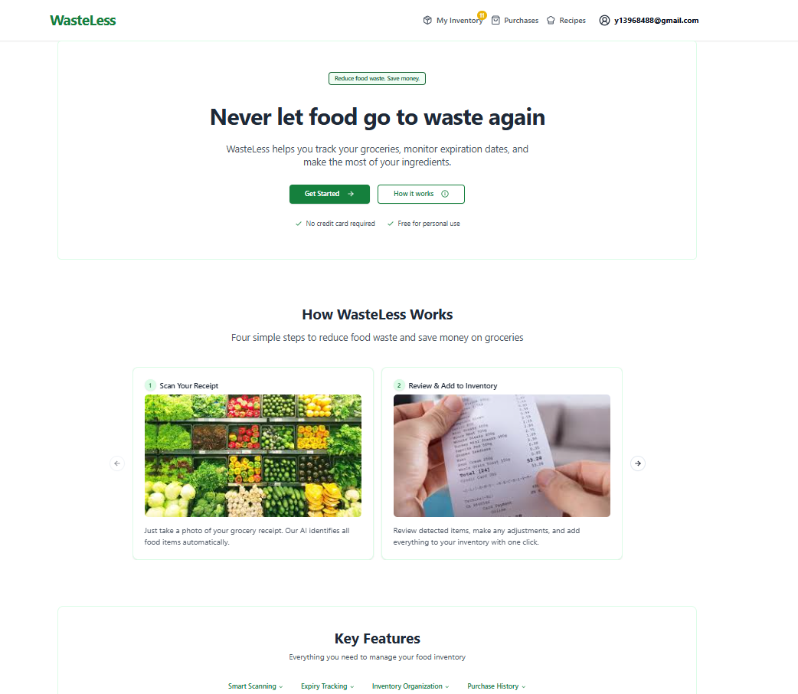
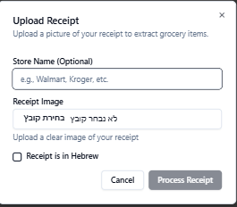
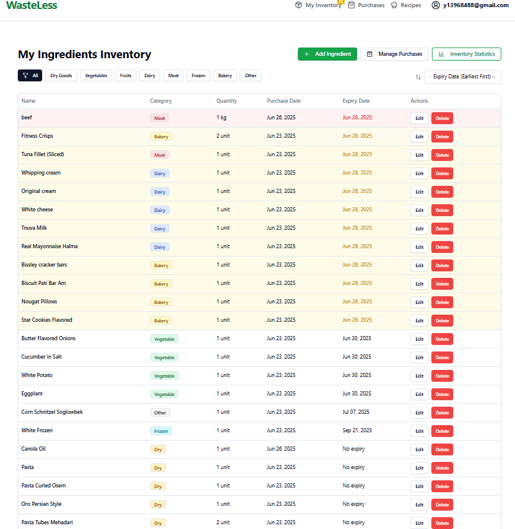
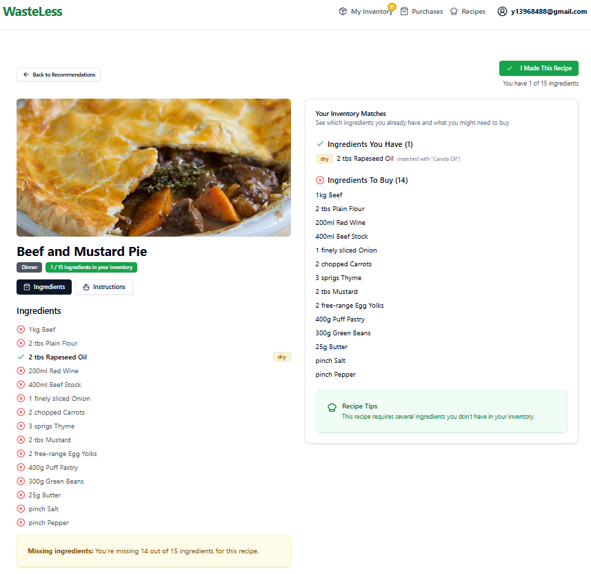
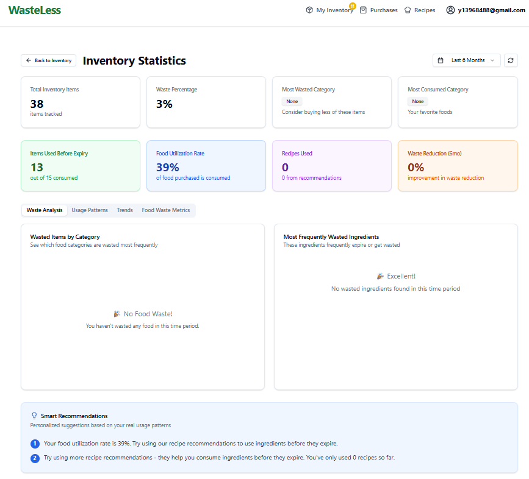
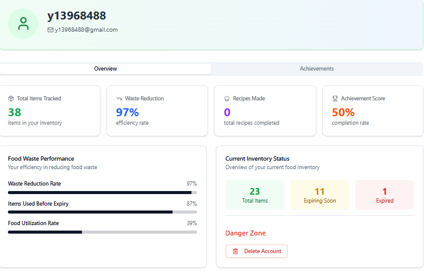
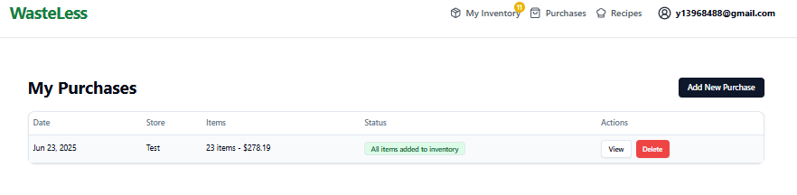
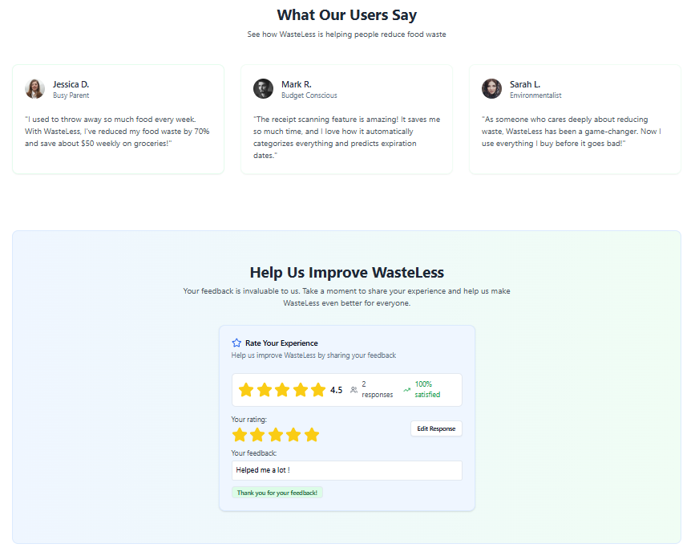

# WasteLess 🥬



A comprehensive full-stack food inventory management and recipe recommendation application that helps users reduce food waste through smart tracking, AI-powered receipt processing, and intelligent recipe suggestions.

## 🌟 Overview

WasteLess addresses the critical issue of household food waste by providing users with an intelligent system to track their groceries, monitor expiration dates, and receive personalized recipe recommendations. The application leverages advanced AI technologies including computer vision, natural language processing, and graph theory algorithms to create an optimal food management experience.

### Key Problems Solved

- **Food Waste Reduction**: Helps users consume ingredients before they expire
- **Inventory Management**: Automated tracking of grocery items with smart categorization
- **Recipe Discovery**: AI-powered recommendations based on available ingredients
- **Expense Optimization**: Reduces unnecessary food purchases and waste

## 🚀 Features

### 🤖 AI-Powered Receipt Processing

- **Multi-language OCR**: Process receipts in English and Hebrew using Google Cloud Vision API
- **Smart Item Extraction**: Claude AI automatically identifies and categorizes food items
- **Automatic Categorization**: Items are classified into categories (dairy, meat, vegetables, etc.)
- **Expiration Prediction**: Intelligent calculation of expiration dates based on food categories

### 📦 Smart Inventory Management

- **Real-time Tracking**: Monitor all food items with quantities and expiration dates
- **Category-based Organization**: Filter and sort items by food categories
- **Expiration Alerts**: Visual indicators and notifications for items about to expire
- **Status Tracking**: Track items as available, consumed, expired, or wasted

### 👨‍🍳 Intelligent Recipe Recommendations

- **Max Flow Algorithm**: Advanced graph-based matching between ingredients and recipes
- **Expiry Prioritization**: Recipes that use ingredients about to expire are prioritized
- **Nutrition Balance**: Algorithm considers nutritional variety in recommendations
- **Customizable Preferences**: Filter by meal type and specific ingredient preferences

### 📊 Analytics & Insights

- **Waste Analytics**: Detailed statistics on food waste patterns
- **Consumption Tracking**: Monitor food utilization rates and trends
- **Achievement System**: Gamified experience with waste reduction goals
- **Smart Recommendations**: Personalized suggestions based on usage patterns

### 👤 User Management

- **Secure Authentication**: Auth0 integration for secure user management
- **Profile Management**: Track personal statistics and achievements
- **Data Privacy**: Secure handling of personal food data

## 🔄 System Flow

The application follows an intuitive user journey designed to minimize food waste:

### 1. User Registration/Login
Users authenticate securely through Auth0 integration.

### 2. Receipt Upload & Processing


- Users upload receipt images through an intuitive interface
- Support for both English and Hebrew receipts
- AI processes and extracts grocery items automatically

### 3. Inventory Management


- Extracted items are added to the user's inventory
- Smart expiration date calculation based on food categories
- Real-time tracking of item status and expiration alerts
- Real-time expiration tracking and alerts

### 4. Recipe Recommendations


- AI generates personalized recipe suggestions
- Prioritizes ingredients about to expire
- Shows ingredient matching and missing items
- Intelligent recipe matching based on available inventory

### 5. Recipe Selection & Cooking


- Users can view detailed recipe instructions
- Clear indication of available vs. missing ingredients
- One-click recipe completion updates inventory

### 6. Analytics & Insights + Smart Recipe Recommendations


- Comprehensive waste analysis by category
- Food utilization rates and consumption patterns
- Smart recommendations for waste reduction improvement
- Prioritized ingredient usage to prevent waste

### 7. User Dashboard & Profile


- Personal waste reduction statistics and achievements
- Track total items, waste percentage, and recipes completed
- Monitor food utilization rates and improvement trends

### 8. Purchase History Tracking


- Complete history of all processed receipts
- Track total items and spending per purchase
- Easy access to review and manage past purchases

### 9. User Testimonials & Feedback


- Real user success stories and experiences
- Built-in feedback system for continuous improvement
- High user satisfaction with 4.5/5 star rating

## 🛠 Technology Stack

### Backend Technologies

- **Runtime**: Node.js with Express.js framework
- **Language**: TypeScript for type safety
- **Database**: MongoDB with Mongoose ODM
- **Authentication**: Auth0 for secure user management
- **AI Services**:
  - Google Cloud Vision API (OCR)
  - Google Cloud Translate API (Hebrew translation)
  - Claude API (food item extraction and categorization)

### Frontend Technologies

- **Framework**: React 18 with TypeScript
- **State Management**: React Query for server state
- **Routing**: React Router v6
- **Styling**: Tailwind CSS with shadcn/ui components
- **Charts**: Recharts for data visualization
- **UI Components**: Radix UI primitives for accessibility

### Key Libraries & Dependencies

#### Backend Dependencies
```json
{
  "@google-cloud/vision": "^4.0.0",
  "@google-cloud/translate": "^8.0.0",
  "express": "^4.18.0",
  "mongoose": "^7.0.0",
  "express-oauth2-jwt-bearer": "^1.6.0",
  "multer": "^1.4.5",
  "date-fns": "^2.29.0",
  "axios": "^1.4.0"
}
```

#### Frontend Dependencies
```json
{
  "react": "^18.2.0",
  "react-query": "^3.39.0",
  "@auth0/auth0-react": "^2.2.0",
  "react-router-dom": "^6.11.0",
  "tailwindcss": "^3.3.0",
  "@radix-ui/react-*": "^1.0.0",
  "recharts": "^2.6.0",
  "lucide-react": "^0.263.0",
  "sonner": "^1.0.0"
}
```

## 🧮 Algorithm & Core Technology

### Max Flow Algorithm Implementation
The heart of WasteLess is an advanced recommendation system built on the Ford-Fulkerson/Edmonds-Karp maximum flow algorithm:

- **Flow Network Construction**: Creates a bipartite graph connecting user ingredients to potential recipes
- **Weight Assignment**: Assigns weights based on:
  - Expiration urgency (higher weight for items about to expire)
  - Ingredient match quality using advanced string matching
  - Recipe relevance and nutritional balance
- **Optimal Flow Calculation**: Uses max flow to find the best ingredient-to-recipe matchings
- **Multi-factor Scoring**: Comprehensive scoring system considering:
  - Coverage ratio (how many recipe ingredients are available)
  - Expiry urgency
  - Nutrition balance
  - User preferences

### Intelligent Ingredient Matching

- **Synonym Recognition**: Advanced matching for ingredient variations
- **Category Compatibility**: Ensures logical ingredient substitutions
- **Quality Scoring**: Confidence-based matching with fallback options

## 📋 Installation & Setup

### Prerequisites

- Node.js (v16 or higher)
- MongoDB instance
- Google Cloud Platform account with Vision and Translate APIs enabled
- Claude API access
- Auth0 account for authentication

### Backend Setup
```bash
# Clone the repository
git clone https://github.com/AvielZaman/Final-Project--WasteLess.git
cd wasteless/backend

# Install dependencies
npm install

# Set up environment variables
cp .env.example .env
# Configure your API keys and database connections

# Start the development server
npm run dev
```

### Frontend Setup
```bash
# Navigate to frontend directory
cd ../frontend

# Install dependencies
npm install

# Set up environment variables
cp .env.example .env.local
# Configure your Auth0 and API endpoints

# Start the development server
npm run dev
```

### Environment Variables

#### Backend (.env)
```env
MONGODB_CONNECTION_STRING=your_mongodb_connection
AUTH0_AUDIENCE=your_auth0_audience
AUTH0_ISSUER_BASE_URL=your_auth0_domain
GOOGLE_APPLICATION_CREDENTIALS=path_to_google_credentials
CLAUDE_API_KEY=your_claude_api_key
PORT= your_port
```

#### Frontend (.env.local)
```env
VITE_API_BASE_URL=http://localhost:your_port
VITE_AUTH0_DOMAIN=your_auth0_domain
VITE_AUTH0_CLIENT_ID=your_auth0_client_id
VITE_AUTH0_CALLBACK_URL=http://localhost:5173/auth-callback
VITE_AUTH0_AUDIENCE=your_auth0_audience
```

## 🎯 Usage

1. **Sign Up/Login**: Create an account using Auth0 authentication
2. **Upload Receipt**: Take a photo of your grocery receipt and upload it
3. **Review Items**: Verify and edit the AI-extracted grocery items
4. **Add to Inventory**: Add items to your inventory with automatic expiration tracking
5. **Get Recommendations**: View personalized recipe recommendations
6. **Cook & Update**: Select recipes and mark them as completed to update inventory
7. **Track Progress**: Monitor your waste reduction progress in the analytics section

## 🏗 Architecture

### Frontend Architecture

- **Component-Based Design**: Modular, reusable React components
- **Custom Hooks**: Centralized API logic with React Query
- **Context Providers**: Global state management for recipes and user data
- **Protected Routes**: Authentication-based route protection

### Backend Architecture

- **MVC Pattern**: Clear separation of concerns
- **Service Layer**: Complex business logic in dedicated services
- **Middleware Pipeline**: Authentication, validation, and error handling
- **RESTful API**: Consistent, predictable endpoint design

### Database Schema

- **Users**: Auth0 integration with profile data
- **Ingredients**: Inventory items with categories and expiration tracking
- **Purchases**: Receipt data and extracted items
- **Recipes**: Recipe database with ingredients and instructions
- **Statistics**: Usage analytics and waste tracking

## 🚀 Future Enhancements

### Algorithm Optimizations

- **Machine Learning Integration**: Improve ingredient matching with ML models
- **Advanced Nutrition Analysis**: Detailed nutritional information and recommendations
- **Seasonal Adjustments**: Recipe recommendations based on seasonal ingredient availability
- **Collaborative Filtering**: User behavior-based recommendation improvements

### Mobile Application

- **Native Mobile App**: iOS and Android applications with camera integration
- **Offline Support**: Local storage for inventory when offline
- **Push Notifications**: Real-time expiration alerts and recipe suggestions
- **Barcode Scanning**: Quick item addition via barcode scanning

### Communication Features

- **Email Notifications**: Automated expiration alerts and weekly summaries
- **SMS Integration**: Critical expiration alerts via text messages
- **Calendar Integration**: Meal planning with calendar synchronization

### Enhanced Analytics

- **Predictive Analytics**: Forecast food consumption patterns
- **Cost Analysis**: Track monetary savings from waste reduction
- **Environmental Impact**: Calculate carbon footprint reduction
- **Social Sharing**: Share achievements and compete with friends

### Advanced Features

- **Meal Planning**: AI-powered weekly meal planning
- **Shopping List Generation**: Automatic shopping lists based on meal plans
- **Inventory Sharing**: Family account management with shared inventories
- **Restaurant Integration**: Recipe suggestions from local restaurants
- **Smart Home Integration**: IoT device connectivity for automated tracking

## 🤝 Contributing

We welcome contributions to WasteLess! Please read our Contributing Guidelines for details on our code of conduct and the process for submitting pull requests.

### Development Guidelines

- Follow TypeScript best practices
- Maintain test coverage above 80%
- Use conventional commit messages
- Update documentation for new features

## 📄 License

This project is licensed under the MIT License - see the LICENSE file for details.

## 🙏 Acknowledgments

- Google Cloud Platform for Vision and Translate APIs
- Anthropic for Claude AI capabilities
- Auth0 for authentication services
- shadcn/ui for beautiful UI components
- Radix UI for accessible component primitives

## 📞 Support

For support and questions:

- Create an issue in this repository
- Contact us at support@wasteless.app
- Check our documentation for detailed guides

---

**WasteLess** - Turning food waste into culinary creativity, one recipe at a time 🌱